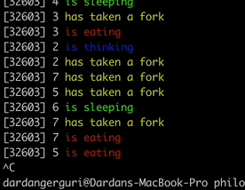

# Philosophers

Philosophers project aims to implement a solution to the classic dining philosophers problem using only threads and mutexes.



## About the project

The dining philosophers problem is a classic synchronization problem that illustrates the challenges of resource allocation and deadlock avoidance in a concurrent system. The problem involves a finite number of philosophers sitting around a table with a bowl of spaghetti. Each philosopher alternates between thinking and eating, but they require two forks to eat.

### Problem description

- There are N philosophers sitting around a circular table.
- Each philosopher can only do three things: eat, think, or sleep.
- To eat, a philosopher needs to acquire two forks (one from the left and one from the right).
- Once a philosopher finishes eating, they put down the forks and sleeps, then starts thinking again.
- Philosophers alternate between thinking and eating indefinitely.

### Constraints
- Only one philosopher can hold a fork at a time.
- Philosophers can't communicate with each other.
- Deadlock must be avoided. Deadlock occurs when each philosopher holds one fork and waits indefinitely for the other.
  
## Running the project

To run the project, first clone the repository and navigate into the project directory. Then, `cd philo` to change the directory, as it was required by the subject that the source files are inside a directory called philo.

Then, use the `make` command to compile the project.

Once the project is compiled, you can run it with the following command:

``` bash
./philo <number_of_philosophers> <time_to_die> <time_to_eat> <time_to_sleep> [optional: <number_of_times_each_philosopher_must_eat>]
```

- `number_of_philosophers:` the number of philosophers around the table.
- `time_to_die:` the time in milliseconds a philosopher has to live after a meal. If a philosopher hasn’t started eating `time_to_die` milliseconds after the beginning of his last meal or the beginning of the simulation, he will die.
- `time_to_eat:` the time in milliseconds a philosopher takes to finish his meal. During that time, the philosopher keeps his two forks in hand.
- `time_to_sleep:` the time in milliseconds that a philosopher spends sleeping.
- `number_of_times_each_philosopher_must_eat:` an optional argument that allows the program to stop if all the philosophers have eaten at least that many times. If this argument is not specified, the simulation carries on unless a philosopher dies.

Here are some examples provided along with their expected outcomes:

`./philo 1 800 200 200` In this case, there's only one philosopher. Since there's only one philosopher and they need two forks to eat, they won't be able to eat and will eventually die due to starvation.

`./philo 5 800 200 200` With five philosophers and appropriate time parameters, no philosopher should die as they can all acquire the necessary forks to eat without any conflicts.

`./philo 5 800 200 200 7` Similar to the previous case, but this time the simulation should stop when every philosopher has eaten at least 7 times.

`./philo 4 410 200 200` With four philosophers and appropriate time parameters, no philosopher should die as they can all acquire the necessary forks to eat without any conflicts.

`./philo 4 310 200 100` In this scenario, one philosopher should die due to starvation. The time to die is shorter than the time it takes for a philosopher to eat, ensuring that at least one philosopher can't eat in time and dies.


## What is a thread, mutex, data race, deadlock?

#### Threads
A thread is a separate flow of execution within a process, managed by the operating system's kernel. Threads share the same memory space within a process, allowing for efficient communication and resource sharing.

#### Mutexes
Mutexes, or mutual exclusions, are synchronization primitives used to control access to shared resources. They act as locks, allowing only one thread to access a resource at a time, thus preventing data corruption and ensuring consistency.

#### Data races
Data races occur when multiple threads access shared data concurrently without proper synchronization. This can lead to unpredictable behavior and incorrect results due to the non-deterministic nature of thread execution. Mutexes are commonly used to prevent data races by serializing access to shared resources.

#### Deadlocks
Deadlocks occur when two or more threads are waiting indefinitely for each other to release resources that they need. This situation typically arises when multiple threads hold resources and wait for others while holding onto their own resources. Deadlocks can be avoided by carefully managing resource acquisition and release, and by ensuring that threads do not hold resources indefinitely while waiting for others.
